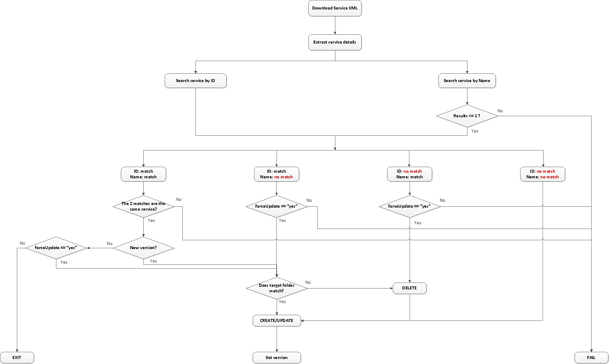

# apigw_migrateService.yml

Ansible playbook to migrate service(s) from one gateway to another 

## Overview

A service can be migrated by exporting it from source gateway and import into destination gateway. This playbook only handles the import action of either a single service or all pre-defined services.

The playbook expects a repository (in Artifactory) where exported services are stored following the naming convention ```<serviceName>-<serviceExportVersion>.xml```. The serviceExportVersion is an identifier (format: ```<serviceVersion>.<policyVersion>.n```) to differentiate changes made in source Gateway so that the migration can be targeted or rolled back.

The following assumptions were made:
- there will not be services with duplicated name
- all services are stored in a single root level directory (**SecurityServices** by default)
- manual changes on target Gateway should be avoid, the playbook is not meant to rectify all manual changes
- there is a dedicated source gateway therefore service ID should remain the same
- only pre-defined services (in config file) can be imported, for example:
```
securityServices:
  OrderExecution_Service: 5.45.0
  RBS API Payment (RBS DE Spike): 3.13.0
```

The main use cases are:

1. create new service 
2. update an existing service that matches both the name and ID in the exported XML
3. update an existing service that matches only the name of the exported XML, in which case, the existing service will be deleted and re-created with the right ID.
4. update an existing service that matches only the ID of the exported XML, so that the name will be overwritten 
5. Apply above use cases on all defined services on the target Gateway

The playbook will not process in the following scenarios:
- the target folder is not found on destination Gateway
- multiple services with the same name found on destination gateway 
- service ID and name match different services on destination gateway
- 'forceUpdate=true' is not specified for use case 3 and 4

**NOTE**: when running the playbook against "all" services, it will abort if any one of the service fails.

The diagram below shows high level logic of the playbook.


 
## Prerequisites

1. Consul access token is required to read KV. It can either be defined in environment var **CONSUL_HTTP_TOKEN** or pass into the playbook as extra var **consulTokenPassword**
2. A gateway user with write permission. 'ssgconfig' user by default.
3. The target services and version have been upload to Artifactory
4. The target service and version is defined in ```files/config/(nonprody|prod).yml```

## Variables Used

The following vars must be passed into the playook as extra vars:
- **awsEnv**: target environment
- **awsRegion**: target AWS region
- **targetService**: this can be one of the following
   - the name of a single service to be migrated
   - "all", which will update all defined services in the config file

The following vars are optional depends on the use cases:
- **forceUpdate**: to confirm overwriting of existing objects

The following vars are required by the roles and have been defined as groups_var for apigw host group. They can be passed into the playbook as extra vars to overwrite default values:
- **apigwMgmtEndpoint**: default to "https://localhost:8443"
- **apigwUser**: default to "ssgconfig"
- **apigwPassword**: default to the initial password stored in Consul.

## Getting Started

Examples:
```
$ export CONSUL_HTTP_TOKEN=XXXX
# 'forceUpdate' is only required when overwritting existing services; 'apigwPassword' is only required when the initial password has been updated

# update or create a single service
$ ansible-playbook playbooks/apigw/apigw_migrateService.yml -e "awsEnv=lab awsRegion=eu-west-1 targetService=OrderExecution_Service"  [-e 'forceUpdate=true'] [-e "apigwPassword=XXXX"]

# update all defined services
$ ansible-playbook playbooks/apigw/apigw_migrateService.yml -e "awsEnv=lab awsRegion=eu-west-1 targetService=all"  [-e 'forceUpdate=true'] [-e "apigwPassword=XXXX"]

# running against a single host
$ ansible-playbook playbooks/apigw/apigw_migrateService.yml -e "awsEnv=lab awsRegion=eu-west-1 targetService=all" -e targetHosts='["10.8.98.59"]'  [-e 'forceUpdate=true'] [-e "apigwPassword=XXXX"] 
```
