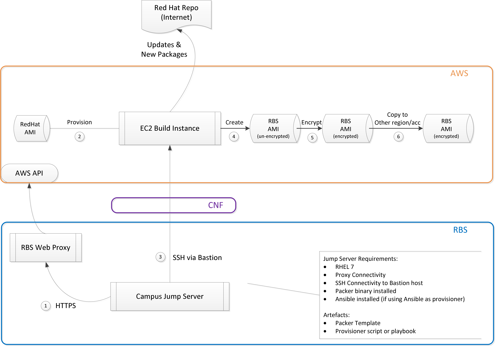

# Overview
This is an example profile for building customised RHEL AMI images with hardending.



# Prerequisite: 
* it needs to be executed on a jump server which has SSH access to the Bastion servers
* `https_proxy` needs to be exported as envrionment variable. 
* Packer can be installed following official documentation. Note because of the conflict of existing packer executable on RHEL system, it has been renamed to ```packer.io``` instead. 

# Usage

While most variables can be overwritten, three of them must be set at runtime because they depend on how each individual setup their environment:
* ```aws_profile```: this is the profile name for NWM Shared Services account in your AWS credential file 
* ```bastion_host```: the IP or hostname of the Bastion instance in NWM Shared Services VPC
* ```ssh_key_file```: an **absolute** path to the SSH key which has access to Bastion instance

While not strictly required, it is also recommended always set the following variables at runtime:
* ```ami_version```: part of the version identifier

For example:
```bash
# To run syntex check
packer.io validate -var "aws_profile=XXX" -var "bastion_host=X.X.X.X" -var "ssh_key_file=XXX" -var "ami_version=1.0.4" nwm_rhel7.json
# To create new AMI
packer.io build -var "aws_profile=XXX" -var "bastion_host=X.X.X.X" -var "ssh_key_file=XXX" -var "ami_version=1.0.4" nwm_rhel7.json
# To enable debug
* `PACKER_LOG=packer.log` packer.io build -var "aws_profile=XXX" -var "bastion_host=X.X.X.X" -var "ssh_key_file=XXX" nwm_rhel7.json
# `TMPDIR` can be set ideally to `%HOME/tmp` and to be created, this is because packer uses /tmp by default to create any local scripts and executes them, it can't do this on the hardened build as all /tmp and /var/tmp cannot execute commands.
```

# Test (TO BE FIXED)
A test script has been created to launch new instances using the new AMI and perform basic connectivity test.
```bash
cd test
./des-rhel7-buildtest.sh
```

# TODO
* vault integration
* improve testing
* Server hardening and customisation requirement, see scripts dir and script
* Manage image update and version 

